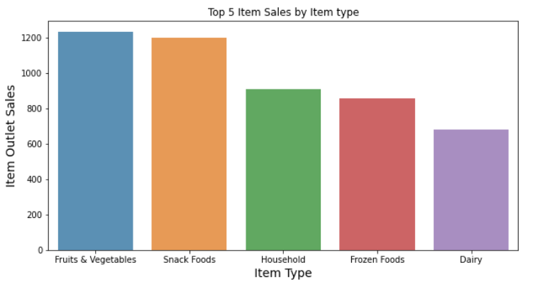
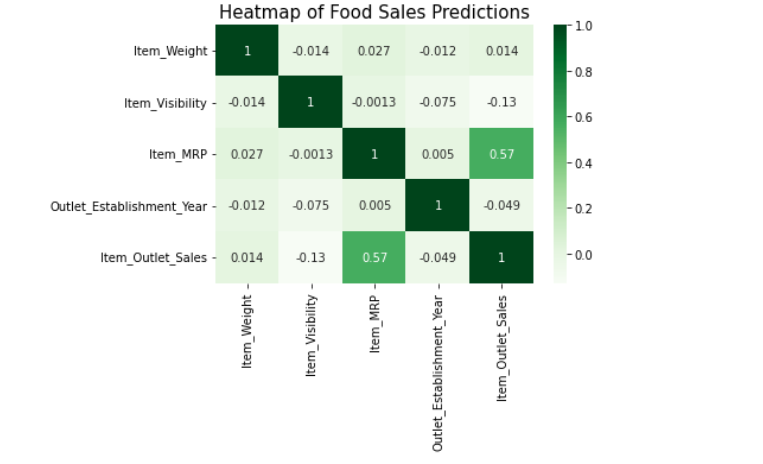

# Predicting Food Sales
## Prediction for food items sold at various stores 

**Author**: Jeancarlo Garcia

### Business problem:

The goal is to help the retailer understand the properties of products and outlets that play crucial roles in increasing sales.

### Data:
Food Sale Predictions Dataset

- There are 8523 rows and 12 columns
- Objects, integers and floats among data types

## Methods
Handling Missing Values

- Columns Item weight and Outlet Size were both missing significant amounts of data (17% and 28% respectively). Allowing these values in our dataset would introduce much room for error. Initially was inclined to replacing Outlet Size missing values with mode. After consideration, I believe that the missing data was too large and would skew the analysis. Dropping both columns should make less room for error.

Duplicate data

- No duplicate data found in the dataset

Standardized values 

- Found incorrect values among the Item Type and Item Fat Content columns. Corrected values to allow for a standard in values in order to account and group all necessary values.

Categorical & Numerical models

- Use of Categorical and Numerical models to present common values and distribution of data.

## Results

#### Top 5 Food Items

> Comparing the item outlet sales by item type we can see what item types drive food sales in the stores. Doubling down on these items may further increase sales.

#### Correlation Heatmap

> There seems to be a moderate correlation between Item MRP and Item Outlet Sales. Than with any other values in the dataset.

## Recommendations:

**Model**

Comparing the Linear Regression and the Regression Tree model, I have found the Regression Tree model to yield best results. Both models provied a good fit in terms of Variance and Bias, although the latter performed better. The Regression Tree model would be best and recommended.

### For further information

For any additional questions, please contact **jeangarcia77@gmail.com**
